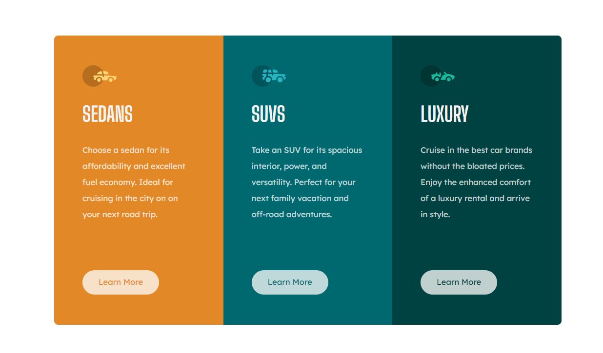
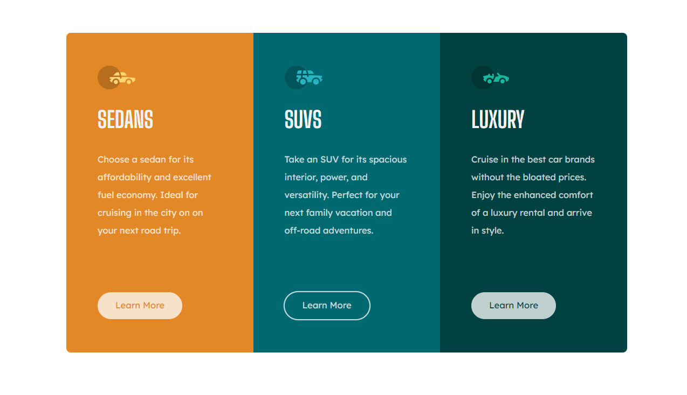

# Frontend Mentor - 3-column preview card component solution

This is a solution to the [3-column preview card component challenge on Frontend Mentor](https://www.frontendmentor.io/challenges/3column-preview-card-component-pH92eAR2-). Frontend Mentor challenges help you improve your coding skills by building realistic projects.

## Table of contents

- [Overview](#overview)
  - [The challenge](#the-challenge)
  - [Screenshot](#screenshot)
  - [Links](#links)
- [My process](#my-process)
  - [Built with](#built-with)
  - [What I learned](#what-i-learned)
  - [Continued development](#continued-development)
- [Author](#author)

## Overview

### The challenge

Users should be able to:

- View the optimal layout depending on their device's screen size
- See hover states for interactive elements

### Screenshot

1. Desktop screenshot

   

2. Desktop (Active) screenshot

   

3. Mobile screenshot

   

### Links

- Solution URL: [GitHub repository](https://github.com/DBoFury/frontend-mentor-challenges/3-column-preview-card-component)
- Live Site URL: [Live site URL](https://dbofury.github.io/frontend-mentor-challenges/3-column-preview-card-component)

## My process

### Built with

- Semantic HTML5 markup
- Vite
- TS
- Flexbox
- Mobile-first workflow
- [React](https://reactjs.org/) - JS library
- [TailwindCSS](https://tailwindcss.com/) - For styles

### What I learned

During this project, I gained a deeper understanding of how to use imported SVG icons as props and incorporate them as JSX elements within components. This allowed for greater flexibility and customization in designing user interfaces. Additionally, I honed my skills in utilizing TailwindCSS and adopting a mobile-first workflow, enabling me to create responsive and visually appealing designs.

### Continued development

As I continue to work with TailwindCSS, I find myself becoming more comfortable and confident in its usage. It has proven to be a powerful and invaluable tool for styling components, streamlining the design process, and achieving consistent and visually appealing results.

## Author

- GitHub - [DBoFury](https://github.com/DBoFury)
- Frontend Mentor - [DBoFury](https://www.frontendmentor.io/profile/DBoFury)
