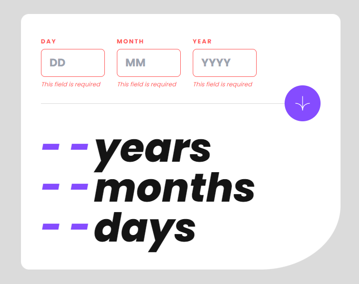

# Frontend Mentor - Age calculator app solution

This is a solution to the [Age calculator app challenge on Frontend Mentor](https://www.frontendmentor.io/challenges/age-calculator-app-dF9DFFpj-Q). Frontend Mentor challenges help you improve your coding skills by building realistic projects.

## Table of contents

- [Overview](#overview)
  - [The challenge](#the-challenge)
  - [Screenshot](#screenshot)
  - [Links](#links)
- [My process](#my-process)
  - [Built with](#built-with)
  - [What I learned](#what-i-learned)
  - [Useful resources](#useful-resources)
- [Author](#author)

## Overview

### The challenge

Users should be able to:

- View an age in years, months, and days after submitting a valid date through the form
- Receive validation errors if:
  - Any field is empty when the form is submitted
  - The day number is not between 1-31
  - The month number is not between 1-12
  - The year is in the future
  - The date is invalid e.g. 31/04/1991 (there are 30 days in April)
- View the optimal layout for the interface depending on their device's screen size
- See hover and focus states for all interactive elements on the page
- **Bonus**: See the age numbers animate to their final number when the form is submitted

### Screenshot

1. Mobile screenshot

2. Mobile active screenshot

3. Mobile calc screenshot

4. Desktop errors screenshot

5. Desktop errors screenshot

### Links

- Solution URL: [GitHub repository](https://dbofury.github.io/frontend-mentor-challenges/age-calculator-app)
- Live Site URL: [Live site URL](https://github.com/DBoFury/frontend-mentor-challenges/tree/develop/src/app/age-calculator-app)

## My process

### Built with

- Semantic HTML5 markup
- Vite
- TS
- Flexbox
- Mobile-first workflow
- [React](https://reactjs.org/) - JS library
- [TailwindCSS](https://tailwindcss.com/) - For styles

### What I learned

One important lesson I've acquired is that there isn't a code or library available for accurately calculating date differences, which seems rather surprising considering the abundance of date-related libraries. It appears that some libraries have limited functionality in certain cases.

Additionally, I gained experience in importing fonts from files, which I believe to be quite useful.

I delved deeper into working with forms by utilizing react-hook-form, which proved helpful in managing validation and submitting data through a form.

Furthermore, I incorporated the react-countup library to animate counting numbers.

### Useful resources

- [Calculate date diff article](https://blog.bitsrc.io/calculate-the-difference-between-two-2-dates-e1d76737c05a) - This article proved instrumental in assisting me with the development of my custom function for calculating the difference between two dates.

## Author

- GitHub - [DBoFury](https://github.com/DBoFury)
- Frontend Mentor - [DBoFury](https://www.frontendmentor.io/profile/DBoFury)
