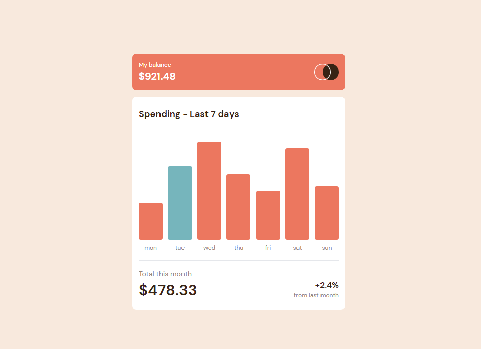
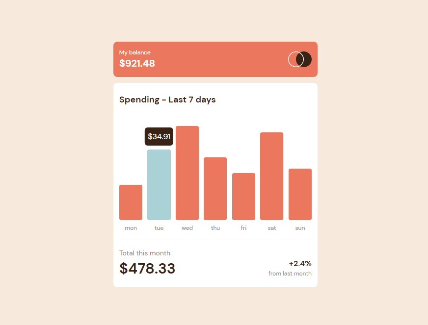
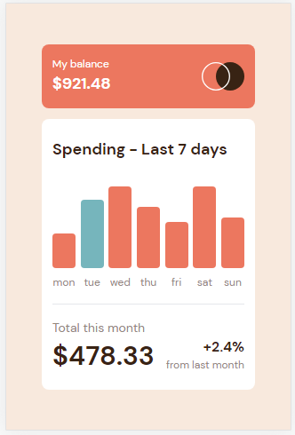

# Frontend Mentor - Expenses chart component solution

This is a solution to the [Expenses chart component challenge on Frontend Mentor](https://www.frontendmentor.io/challenges/expenses-chart-component-e7yJBUdjwt). Frontend Mentor challenges help you improve your coding skills by building realistic projects.

## Table of contents

- [Overview](#overview)
  - [The challenge](#the-challenge)
  - [Screenshot](#screenshot)
  - [Links](#links)
- [My process](#my-process)
  - [Built with](#built-with)
  - [What I learned](#what-i-learned)
- [Author](#author)

## Overview

### The challenge

Users should be able to:

- View the bar chart and hover over the individual bars to see the correct amounts for each day
- See the current day’s bar highlighted in a different colour to the other bars
- View the optimal layout for the content depending on their device’s screen size
- See hover states for all interactive elements on the page
- **Bonus**: Use the JSON data file provided to dynamically size the bars on the chart

### Screenshot

1. Desktop

2. Desktop Active

3. Mobile

### Links

- Solution URL: [GitHub repository](https://github.com/Olacdy/frontend-mentor-challenges/tree/develop/src/app/expenses-chart-component)
- Live Site URL: [Live site URL](https://olacdy.github.io/frontend-mentor-challenges/expenses-chart-component)

## My process

### Built with

- Semantic HTML5 markup
- Vite
- TS
- Flexbox
- Grid layout
- Mobile-first workflow
- [React](https://reactjs.org/) - JS library
- [TailwindCSS](https://tailwindcss.com/) - For styles

### What I learned

I tried using Node libraries to work with charts, but none of them provided the flexibility to define the necessary styles required for this project. Instead, I utilized the "group" class from Tailwind CSS, which allows me to control the styles of child elements based on the state of their parent.

## Author

- GitHub - [Olacdy](https://github.com/Olacdy)
- Frontend Mentor - [DBoFury](https://www.frontendmentor.io/profile/DBoFury)
