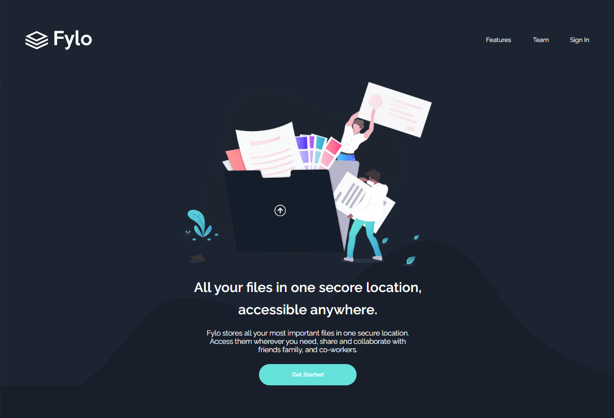
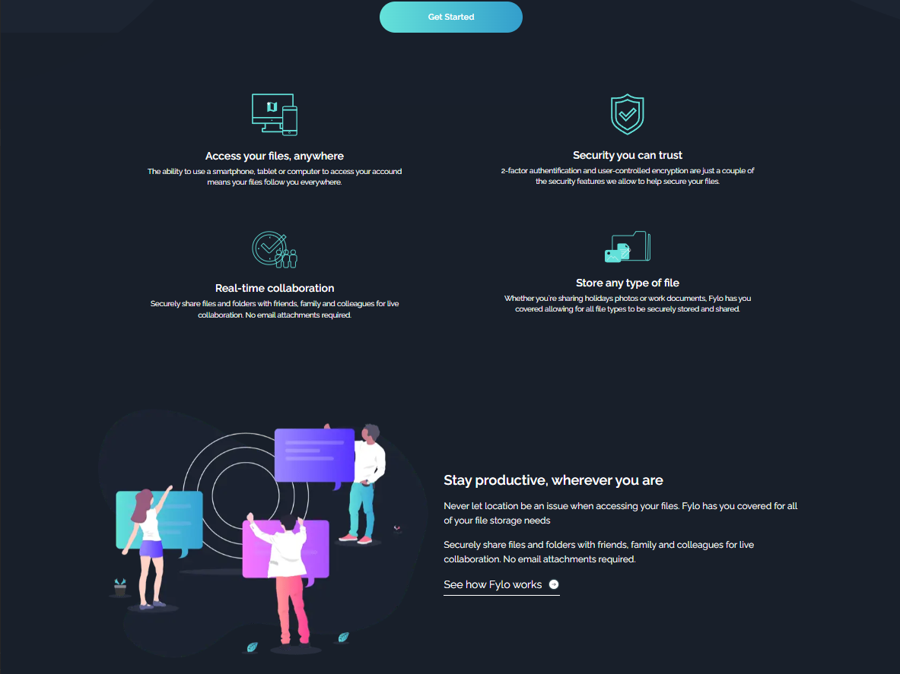
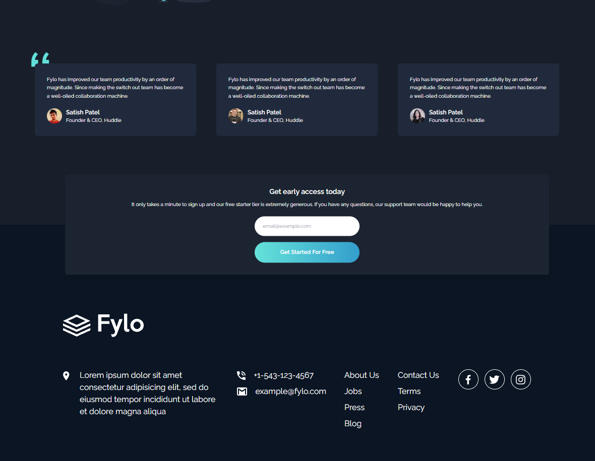
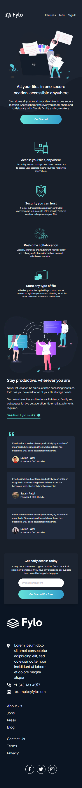

# Frontend Mentor - Fylo dark theme landing page solution

This is a solution to the [Fylo dark theme landing page challenge on Frontend Mentor](https://www.frontendmentor.io/challenges/fylo-dark-theme-landing-page-5ca5f2d21e82137ec91a50fd). Frontend Mentor challenges help you improve your coding skills by building realistic projects.

## Table of contents

- [Overview](#overview)
  - [The challenge](#the-challenge)
  - [Screenshot](#screenshot)
  - [Links](#links)
- [My process](#my-process)
  - [Built with](#built-with)
  - [What I learned](#what-i-learned)
- [Author](#author)

## Overview

### The challenge

Users should be able to:

- View the optimal layout for the site depending on their device's screen size
- See hover states for all interactive elements on the page

### Screenshot

1. Desktop Hero Section
   

2. Desktop Features Section
   

3. Desktop Footer Section
   

4. Mobile

   

### Links

- Solution URL: [GitHub repository](https://github.com/Olacdy/frontend-mentor-challenges/tree/develop/src/app/fylo-dark-theme-landing-page)
- Live Site URL: [Live site URL](https://olacdy.github.io/frontend-mentor-challenges/fylo-dark-theme-landing-page)

## My process

### Built with

- Semantic HTML5 markup
- Next
- TS
- Flexbox
- Grid layout
- Mobile-first workflow
- [React](https://reactjs.org/) - JS library
- [TailwindCSS](https://tailwindcss.com/) - For styles

### What I learned

In this project, I ventured into the realm of NextJS for the very first time. The primary motivation behind this choice is my intention to utilize NextJS in my upcoming personal endeavors. Embracing this technology early on proved to be an excellent practice, allowing me to grow more at ease with its functionalities.

One standout advantage of NextJS is its folder-based routing system, which offers exceptional organization capabilities. This feature enables me to manage all my projects cohesively within a single repository, streamlining the development process and promoting orderliness.

## Author

- GitHub - [Olacdy](https://github.com/Olacdy)
- Frontend Mentor - [DBoFury](https://www.frontendmentor.io/profile/DBoFury)
