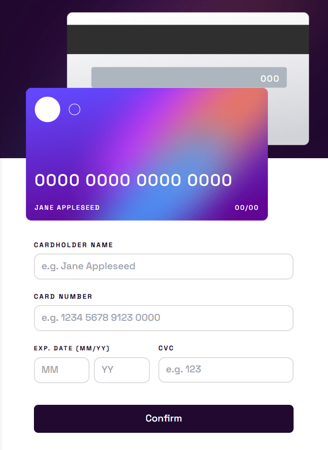
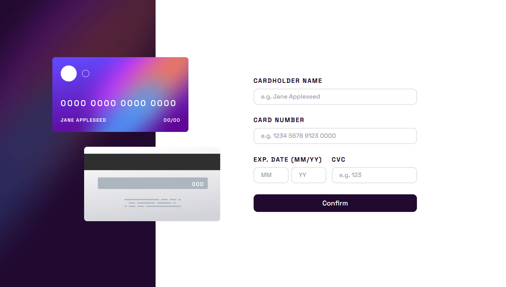
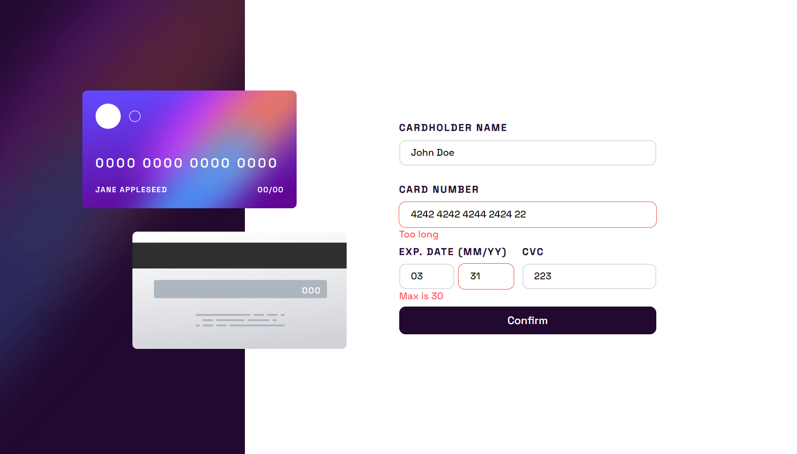

# Frontend Mentor - Interactive card details form solution

This is a solution to the [Interactive card details form challenge on Frontend Mentor](https://www.frontendmentor.io/challenges/interactive-card-details-form-XpS8cKZDWw). Frontend Mentor challenges help you improve your coding skills by building realistic projects.

## Table of contents

- [Overview](#overview)
  - [The challenge](#the-challenge)
  - [Screenshot](#screenshot)
  - [Links](#links)
- [My process](#my-process)
  - [Built with](#built-with)
  - [What I learned](#what-i-learned)
- [Author](#author)
- [Acknowledgments](#acknowledgments)

**Note: Delete this note and update the table of contents based on what sections you keep.**

## Overview

### The challenge

Users should be able to:

- Fill in the form and see the card details update in real-time
- Receive error messages when the form is submitted if:
  - Any input field is empty
  - The card number, expiry date, or CVC fields are in the wrong format
- View the optimal layout depending on their device's screen size
- See hover, active, and focus states for interactive elements on the page

### Screenshot

1. Mobile screenshot

2. Desktop screenshot

3. Desktop active screenshot

4. Desktop completed screenshot

### Links

- Solution URL: [GitHub repository](https://github.com/Olacdy/frontend-mentor-challenges/tree/main/src/app/interactive-card-details-form)
- Live Site URL: [Live site URL](https://olacdy.github.io/frontend-mentor-challenges/interactive-card-details-form)

## My process

### Built with

- Semantic HTML5 markup
- Vite
- TS
- Flexbox
- Mobile-first workflow
- [React](https://reactjs.org/) - JS library
- [TailwindCSS](https://tailwindcss.com/) - For styles

### What I learned

It was indeed a rather difficult challenge. I'm still not too happy with the final result, especially considering how the page renders on different screen sizes.

## Author

- GitHub - [Olacdy](https://github.com/Olacdy)
- Frontend Mentor - [DBoFury](https://www.frontendmentor.io/profile/DBoFury)

## Acknowledgments

Try creating a parent div in the middle of the front and back cards as that is the most useful approach. To move cards, use the transformation operator.
