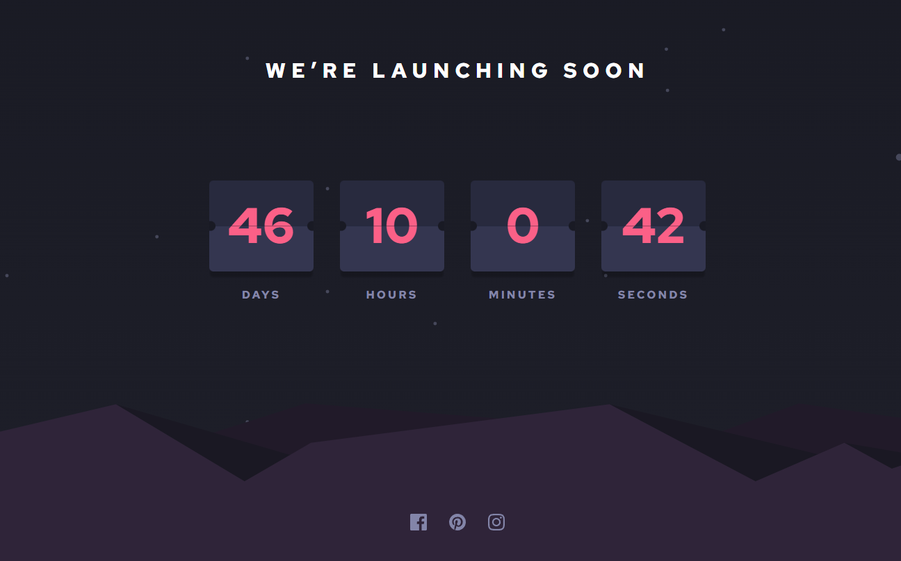
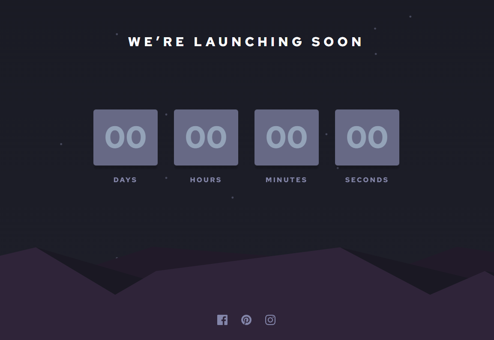
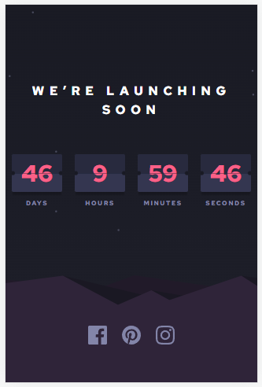

# Frontend Mentor - Launch countdown timer solution

This is a solution to the [Launch countdown timer challenge on Frontend Mentor](https://www.frontendmentor.io/challenges/launch-countdown-timer-N0XkGfyz-). Frontend Mentor challenges help you improve your coding skills by building realistic projects.

## Table of contents

- [Overview](#overview)
  - [The challenge](#the-challenge)
  - [Screenshot](#screenshot)
  - [Links](#links)
- [My process](#my-process)
  - [Built with](#built-with)
  - [What I learned](#what-i-learned)
- [Author](#author)

## Overview

### The challenge

Users should be able to:

- See hover states for all interactive elements on the page
- See a live countdown timer that ticks down every second (start the count at 14 days)
- **Bonus**: When a number changes, make the card flip from the middle

### Screenshot

1. Desktop
   

2. Desktop Active
   

3. Desktop Loading
   

4. Mobile

### Links

- Solution URL: [GitHub repository](https://github.com/DBoFury/launch-countdown-timer/)
- Live Site URL: [Live site URL](https://dbofury.github.io/launch-countdown-timer/)

## My process

### Built with

- Semantic HTML5 markup
- Vite
- TS
- Flexbox
- Grid layout
- Mobile-first workflow
- [React](https://reactjs.org/) - JS library
- [TailwindCSS](https://tailwindcss.com/) - For styles

### What I learned

For this project, I implemented a new technique by utilizing the pseudo-element ::after to generate small dots on the sides of the display. I applied best practices to ensure a responsive application and incorporated a loading state with a pulsing animation.

## Author

- GitHub - [dbofury](https://github.com/DBoFury)
- Frontend Mentor - [@dbofury](https://www.frontendmentor.io/profile/DBoFury)
