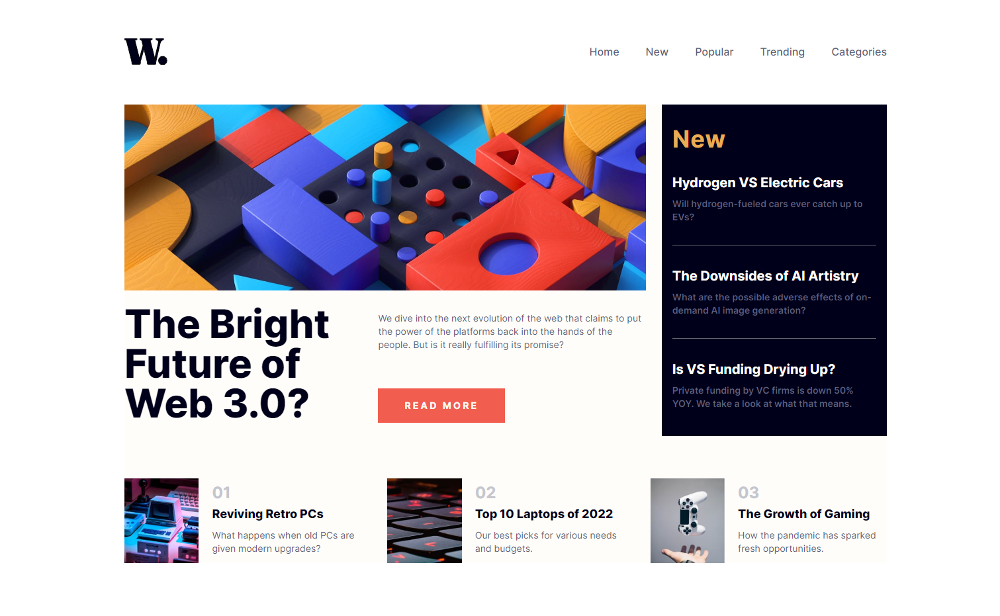
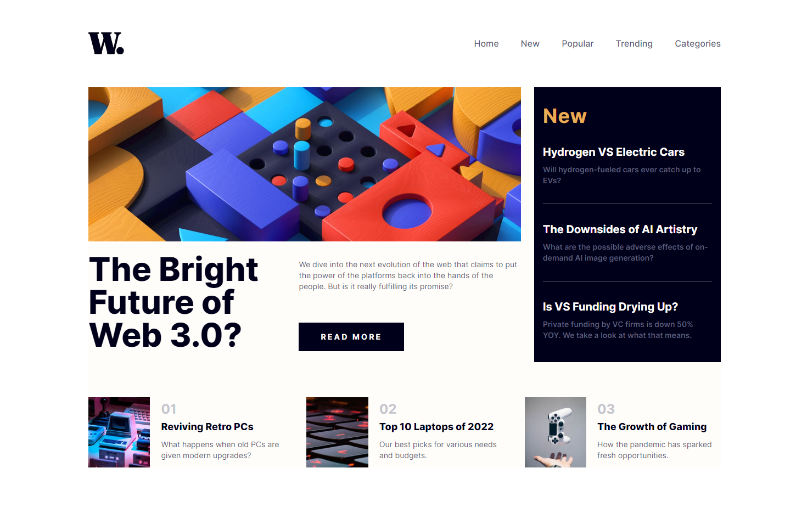
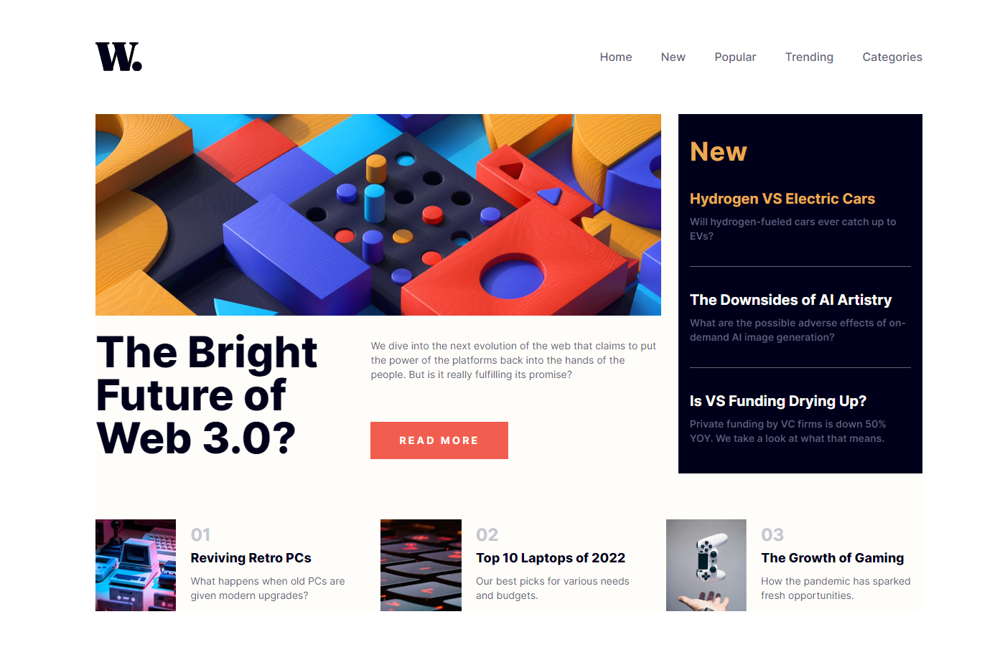
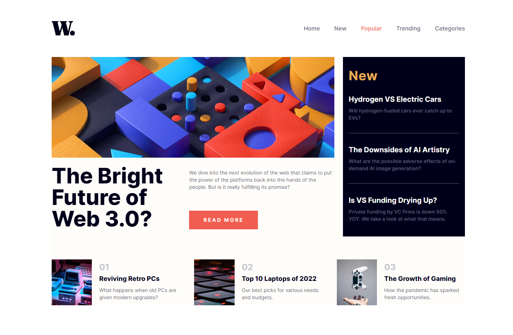
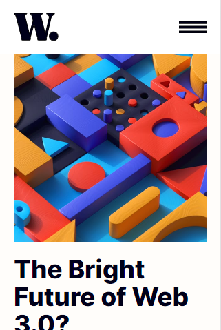
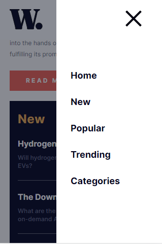

# Frontend Mentor - News homepage solution

This is a solution to the [News homepage challenge on Frontend Mentor](https://www.frontendmentor.io/challenges/news-homepage-H6SWTa1MFl). Frontend Mentor challenges help you improve your coding skills by building realistic projects.

## Table of contents

- [Overview](#overview)
  - [The challenge](#the-challenge)
  - [Screenshot](#screenshot)
  - [Links](#links)
- [My process](#my-process)
  - [Built with](#built-with)
  - [What I learned](#what-i-learned)
- [Author](#author)

## Overview

### The challenge

Users should be able to:

- View the optimal layout for the interface depending on their device's screen size
- See hover and focus states for all interactive elements on the page

### Screenshot

1. Desktop

2. Desktop Active

3. Desktop Active 2

4. Desktop Active 3

5. Mobile

6. Mobile 2

7. Mobile NavBar

### Links

- Solution URL: [GitHub repository](https://github.com/Olacdy/frontend-mentor-challenges/tree/main/src/app/news-homepage)
- Live Site URL: [Live site URL](https://olacdy.github.io/frontend-mentor-challenges/news-homepage)

## My process

### Built with

- Semantic HTML5 markup
- Vite
- TS
- Flexbox
- Mobile-first workflow
- [React](https://reactjs.org/) - JS library
- [TailwindCSS](https://tailwindcss.com/) - For styles

### What I learned

In this project, I have made extensive use of Semantic HTML 5 markup to ensure proper structuring and meaningful elements. Additionally, I have implemented a responsive NavBar that offers enhanced functionality and includes animations specifically designed for mobile devices. Although I have made progress in working with SVG files, handling them in conjunction with Vite is an aspect that I am still in the process of fully comprehending.

## Author

- GitHub - [Olacdy](https://github.com/Olacdy)
- Frontend Mentor - [DBoFury](https://www.frontendmentor.io/profile/DBoFury)
