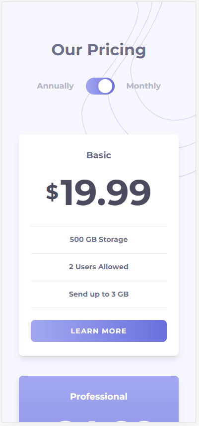

# Frontend Mentor - Pricing component with toggle solution

This is a solution to the [Pricing component with toggle challenge on Frontend Mentor](https://www.frontendmentor.io/challenges/pricing-component-with-toggle-8vPwRMIC). Frontend Mentor challenges help you improve your coding skills by building realistic projects.

## Table of contents

- [Overview](#overview)
  - [The challenge](#the-challenge)
  - [Screenshot](#screenshot)
  - [Links](#links)
- [My process](#my-process)
  - [Built with](#built-with)
  - [What I learned](#what-i-learned)
- [Author](#author)

## Overview

### The challenge

Users should be able to:

- View the optimal layout for the component depending on their device's screen size
- Control the toggle with both their mouse/trackpad and their keyboard
- **Bonus**: Complete the challenge with just HTML and CSS

### Screenshot

1. Desktop

2. Desktop Active

3. Mobile

### Links

- Solution URL: [GitHub repository](https://github.com/Olacdy/frontend-mentor-challenges/tree/main/src/app/pricing-component-with-toggle)
- Live Site URL: [Live site URL](https://olacdy.github.io/frontend-mentor-challenges/pricing-component-with-toggle)

## My process

The main challenge I faced was managing the background images. Initially, I attempted to use a fixed position for them, but this caused the image to scroll along with the entire page. On the other hand, using absolute positioning resulted in overflow, which I resolved by adding a relative position to a parent div and clipping the excess.

### Built with

- Semantic HTML5 markup
- Vite
- TS
- Flexbox
- Grid layout
- Mobile-first workflow
- [React](https://reactjs.org/) - JS library
- [TailwindCSS](https://tailwindcss.com/) - For styles

### What I learned

## Author

- GitHub - [Olacdy](https://github.com/Olacdy)
- Frontend Mentor - [DBoFury](https://www.frontendmentor.io/profile/DBoFury)
