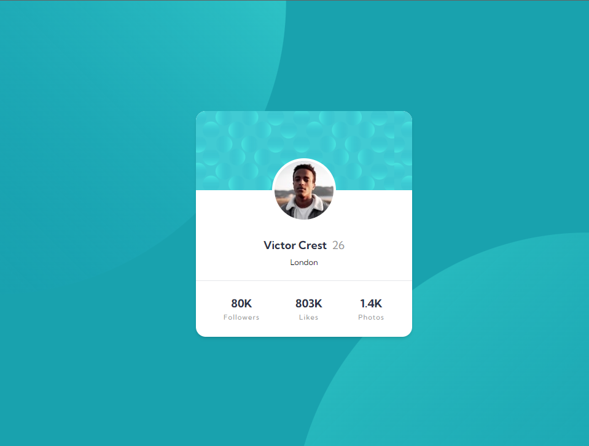
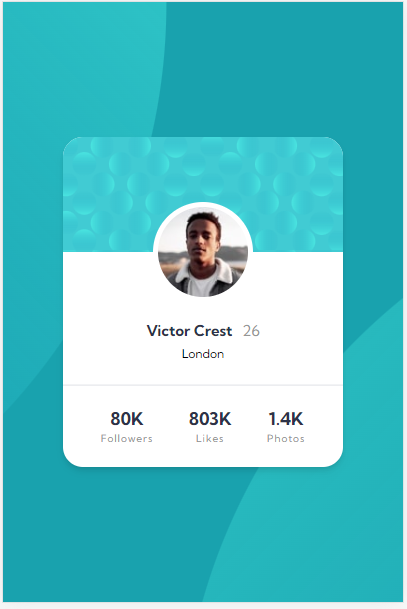

# Frontend Mentor - Profile card component solution

This is a solution to the [Profile card component challenge on Frontend Mentor](https://www.frontendmentor.io/challenges/profile-card-component-cfArpWshJ). Frontend Mentor challenges help you improve your coding skills by building realistic projects.

## Table of contents

- [Overview](#overview)
  - [The challenge](#the-challenge)
  - [Screenshot](#screenshot)
  - [Links](#links)
- [My process](#my-process)
  - [Built with](#built-with)
  - [What I learned](#what-i-learned)
- [Author](#author)

## Overview

### The challenge

- Build out the project to the designs provided

### Screenshot

1. Desktop

2. Mobile

### Links

- Solution URL: [GitHub repository](https://github.com/DBoFury/profile-card-component/)
- Live Site URL: [Live site URL](https://dbofury.github.io/profile-card-component/)

## My process

### Built with

- Semantic HTML5 markup
- Vite
- TS
- Flexbox
- Grid layout
- Mobile-first workflow
- [React](https://reactjs.org/) - JS library
- [TailwindCSS](https://tailwindcss.com/) - For styles

### What I learned

I applied positioning and overflow management using Tailwind CSS and incorporated the Mobile-first approach in my workflow to enhance the implementation.

## Author

- GitHub - [dbofury](https://github.com/DBoFury)
- Frontend Mentor - [@dbofury](https://www.frontendmentor.io/profile/DBoFury)
