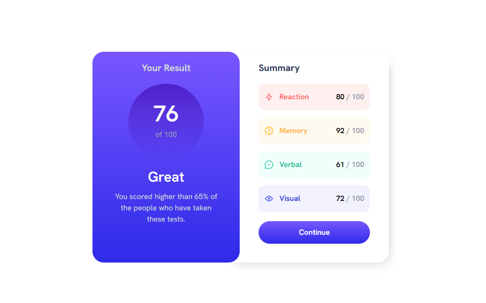
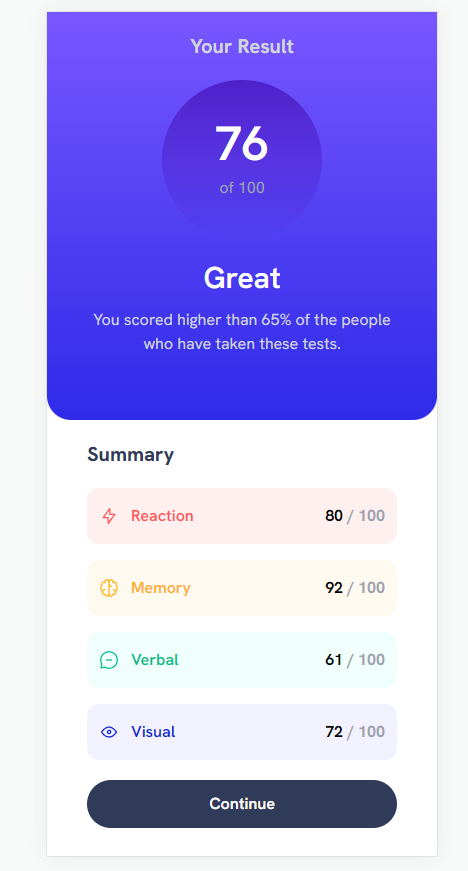

# Frontend Mentor - Results summary component solution

This is a solution to the [Results summary component challenge on Frontend Mentor](https://www.frontendmentor.io/challenges/results-summary-component-CE_K6s0maV). Frontend Mentor challenges help you improve your coding skills by building realistic projects.

## Table of contents

- [Overview](#overview)
  - [The challenge](#the-challenge)
  - [Screenshot](#screenshot)
  - [Links](#links)
- [My process](#my-process)
  - [Built with](#built-with)
  - [What I learned](#what-i-learned)
  - [Continued development](#continued-development)
- [Author](#author)

## Overview

### The challenge

Users should be able to:

- View the optimal layout for the interface depending on their device's screen size
- See hover and focus states for all interactive elements on the page

### Screenshot

1. Desktop screenshot
   
2. Desktop (Active) screenshot
   
3. Mobile screenshot

   

### Links

- Solution URL: [GitHub repository](https://github.com/DBoFury/results-summary-component)
- Live Site URL: [Live site URL here](https://dbofury.github.io/results-summary-component/)

## My process

### Built with

- Semantic HTML5 markup
- Vite
- TS
- Flexbox
- Mobile-first workflow
- [React](https://reactjs.org/) - JS library
- [TailwindCSS](https://tailwindcss.com/) - For styles

### What I learned

When styling your application, it is important to prioritize mobile users. In Tailwind CSS, it is recommended to write styles primarily for mobile users and then specify how to adjust the styles for desktop screens. Additionally, I learned how to incorporate custom styles and colors into Tailwind CSS.

### Continued development

I still have much to learn about developing effective styling strategies for applications. However, using Tailwind CSS certainly makes the styling process more enjoyable compared to using plain CSS alone.

## Author

- GitHub - [dbofury](https://github.com/DBoFury)
- Frontend Mentor - [@dbofury](https://www.frontendmentor.io/profile/frikol3000)
