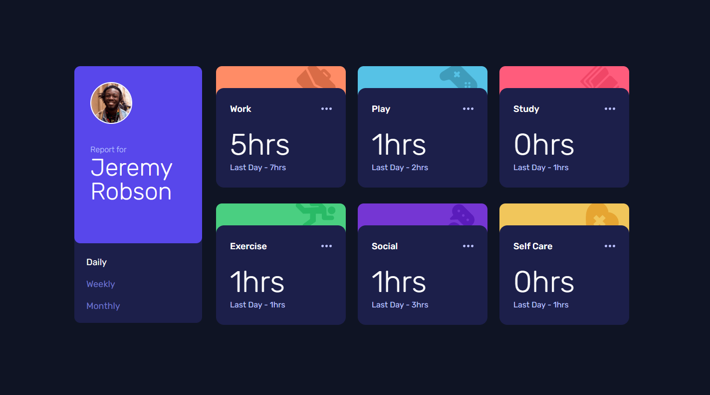
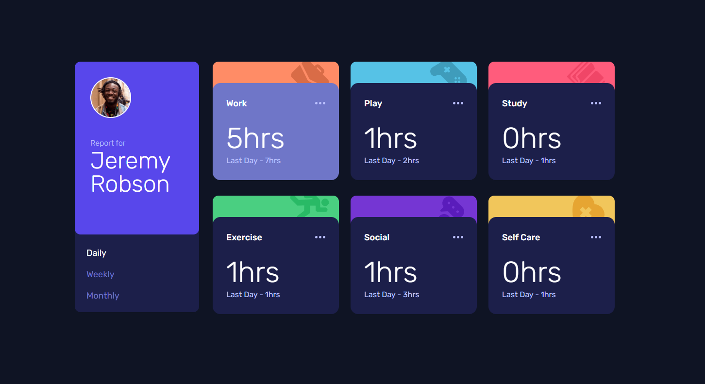
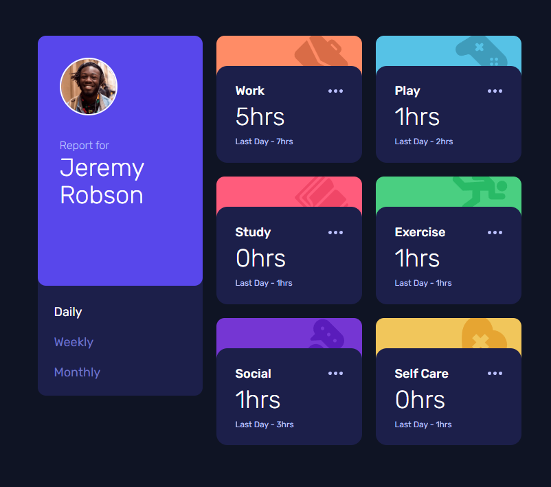
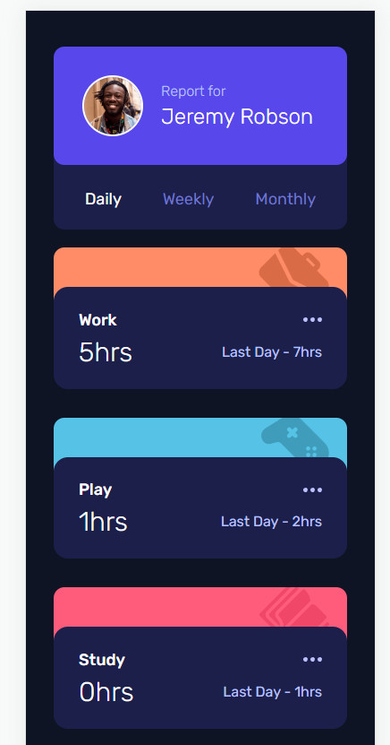

# Frontend Mentor - Time tracking dashboard solution

This is a solution to the [Time tracking dashboard challenge on Frontend Mentor](https://www.frontendmentor.io/challenges/time-tracking-dashboard-UIQ7167Jw). Frontend Mentor challenges help you improve your coding skills by building realistic projects.

## Table of contents

- [Overview](#overview)
  - [The challenge](#the-challenge)
  - [Screenshot](#screenshot)
  - [Links](#links)
- [My process](#my-process)
  - [Built with](#built-with)
  - [What I learned](#what-i-learned)
- [Author](#author)

## Overview

### The challenge

Users should be able to:

- View the optimal layout for the site depending on their device's screen size
- See hover states for all interactive elements on the page
- Switch between viewing Daily, Weekly, and Monthly stats

### Screenshot

1. Desktop

2. Desktop Active

3. Desktop Medium

4. Mobile

### Links

- Solution URL: [GitHub repository](https://github.com/Olacdy/frontend-mentor-challenges/tree/main/src/app/time-tracking-dashboard)
- Live Site URL: [Live site URL](https://olacdy.github.io/frontend-mentor-challenges/time-tracking-dashboard)

## My process

### Built with

- Semantic HTML5 markup
- Vite
- TS
- Flexbox
- Grid layout
- Mobile-first workflow
- [React](https://reactjs.org/) - JS library
- [TailwindCSS](https://tailwindcss.com/) - For styles

### What I learned

During my work on this challenge, I made sure to adhere to best practices for developing with Tailwind CSS. I focused on improving my skills in Mobile-first workflow and ensuring the responsiveness of the page. Additionally, I utilized grid layout techniques to effectively position the activity time boxes.

## Author

- GitHub - [Olacdy](https://github.com/Olacdy)
- Frontend Mentor - [DBoFury](https://www.frontendmentor.io/profile/DBoFury)
